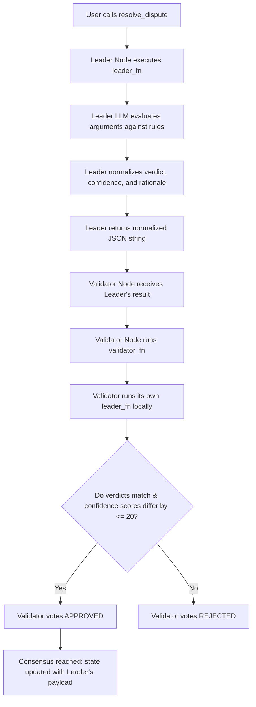

# Subjective Vote Resolver

A decentralized qualitative adjudication primitive built on GenLayer (v0.2.16).

Traditional smart contracts can only tally quantitative parameters (such as token weights or simple transaction sign-offs). In organizational governance, councils, or educational debates, decisions often hinge on subjective, qualitative arguments. This contract resolves that limitation. It takes two opposing qualitative arguments (`argument_a`, `argument_b`) and a set of evaluation `rules` (e.g. "Proposal must be cost-efficient, implementable in 30 days, and prioritize user safety"). It uses a decentralized LLM jury acting as impartial adjudicators to analyze the arguments, outputting a consensus-backed decision: `PARTY_A` wins, `PARTY_B` wins, or a `TIE`.

---

## 🌟 Reusable Adjudication Primitive (Beyond a "One-Off Demo")

This contract serves as a decentralized qualitative debate and dispute resolution engine that can be integrated across multiple institutional flows:
1.  **Professional & DAO Councils:** Resolve complex proposals where voters describe their arguments qualitatively, instead of relying purely on token weightings.
2.  **Educational Debates:** Score student debate entries automatically based on classroom rubric constraints (rules).
3.  **Grant Approval Committees:** Evaluate competing grant applications against regional project requirements.

---

## 🏗️ Storage & State Design

The contract maintains state using GenLayer's persistent storage:
*   **`DisputeRecord` (Struct):** An `@allow_storage @dataclass` holding the rules checklist, opposing arguments, consensus verdict (`PARTY_A`, `PARTY_B`, or `TIE`), validator confidence score (`bigint`), and qualitative rationale explanation.
*   **`records` (TreeMap):** A persistent lookup table mapped from `str(record_id)` to `DisputeRecord`.
*   **`next_id` (bigint):** An auto-incrementing ID tracking the total number of adjudications recorded.

---

## 🤝 Custom Validator Consensus Logic

Adjudicating qualitative debates involves subjective reasoning. To reach consensus stable against individual model biases, the contract uses a **Custom Validator** via `gl.vm.run_nondet_unsafe(leader_fn, validator_fn)`:



### Consensus Rules:
1.  **Normalization:** The LLM's winner verdict is normalized into either `"PARTY_A"`, `"PARTY_B"`, or `"TIE"`. The confidence score is coerced to a `0..100` integer.
2.  **Verdict Category Equality:** The validator checks if its independent run yields the **exact same verdict** (e.g., both agree that `PARTY_B` prevails).
3.  **Confidence Score Banding:** The validator checks if its confidence score is within an **absolute difference of 20 points** of the leader's score (`abs(leader_confidence - mine_confidence) <= 20`).
4.  **Rationale Text Exemption:** The validator **ignores** differences in the qualitative `rationale` string, preventing consensus failure due to harmless synonym variations in the generated explanation text.

---

## 🧪 Edge Case Testing Guidelines

You can test the contract using GenLayer Studio or CLI using the following scenarios:

### 1. Clear Winner (Party B Wins)
*   **Rules:** "The proposed educational method must have high practical application, be easy to understand for Grade 4 kids, and incorporate gamification."
*   **Argument A:** "We should write multiplications 100 times on a chalkboard to force memory retention."
*   **Argument B:** "We will run a Math Forest gaming app where children cross hurdles by solving arithmetic."
*   **Expected Result:** Verdict: `PARTY_B`, Confidence: `~90-100`, Rationale pointing out that Party B meets the gamification criteria while Party A uses rote learning.

### 2. Opposite Winner (Party A Wins)
*   **Rules:** "The solution must be completely offline, cost-free, and require no electronics."
*   **Argument A:** "We will print paper handouts of puzzles for kids to solve at their desks."
*   **Argument B:** "We will buy virtual reality headsets and load math simulator software."
*   **Expected Result:** Verdict: `PARTY_A`, Confidence: `~90-100`, Rationale pointing out that Party A meets the offline/cost-free rules.

### 3. Draw / Equal Strength (TIE Path)
*   **Rules:** "The method must use active physical exercise in the classroom."
*   **Argument A:** "We will make kids stand up and jump when answering questions."
*   **Argument B:** "We will play a game where children run to different corners of the room based on the response."
*   **Expected Result:** Verdict: `TIE`, Confidence: `~80-100`, Rationale noting that both parties successfully utilize active physical movement.

### 4. Edge Case: Empty Fields
*   **Inputs:** `argument_a = ""`, `argument_b = ""`, or `rules = ""`
*   **Expected Result:** The contract throws a `UserError` immediately.

---

## 🌐 Deployment & Test Evidence

*   **Contract Address:** `[YOUR_DEPLOYED_CONTRACT_ADDRESS_HERE]`
*   **Network:** `studionet`

### Worked Example (Illustrative Example)

#### Example Call:
```python
contract.resolve_dispute(
    argument_a="We should write tables 100 times.",
    argument_b="We will run a Math Forest gaming app where children cross hurdles by solving arithmetic.",
    rules="Syllabus must use interactive gamification for elementary kids."
)
```

#### Expected Output (JSON from `get_record` view):
```json
{
  "id": "0",
  "rules": "Syllabus must use interactive gamification for elementary kids.",
  "argument_a": "We should write tables 100 times.",
  "argument_b": "We will run a Math Forest gaming app where children cross hurdles by solving arithmetic.",
  "verdict": "PARTY_B",
  "confidence": 95,
  "rationale": "Argument B uses gamification which directly meets the primary classroom requirements."
}
```
*Note: The rationale field is illustrative of the natural language response, while the verdict and confidence band represent the verified consensus values.*
